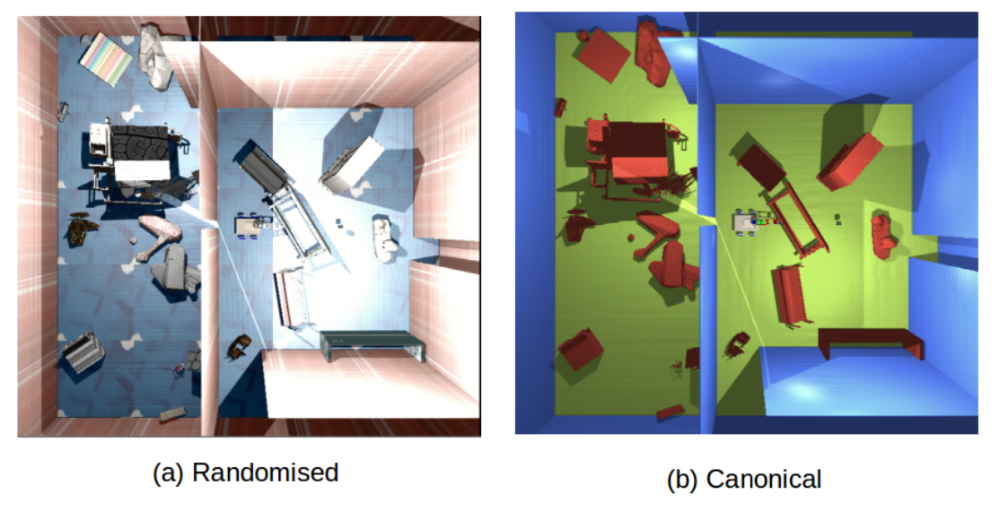
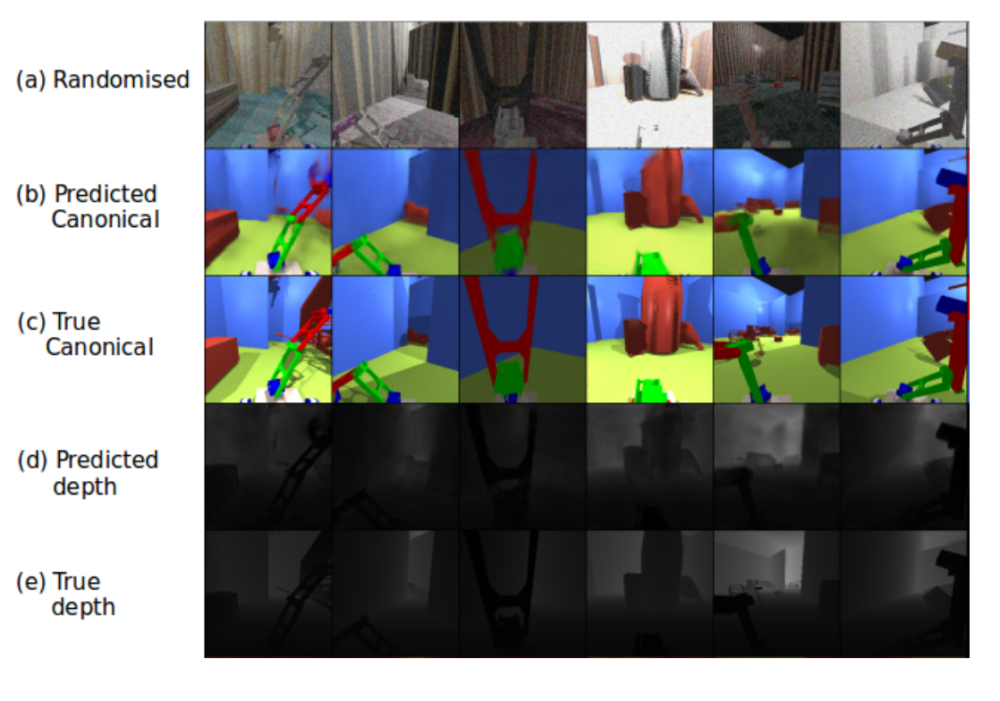
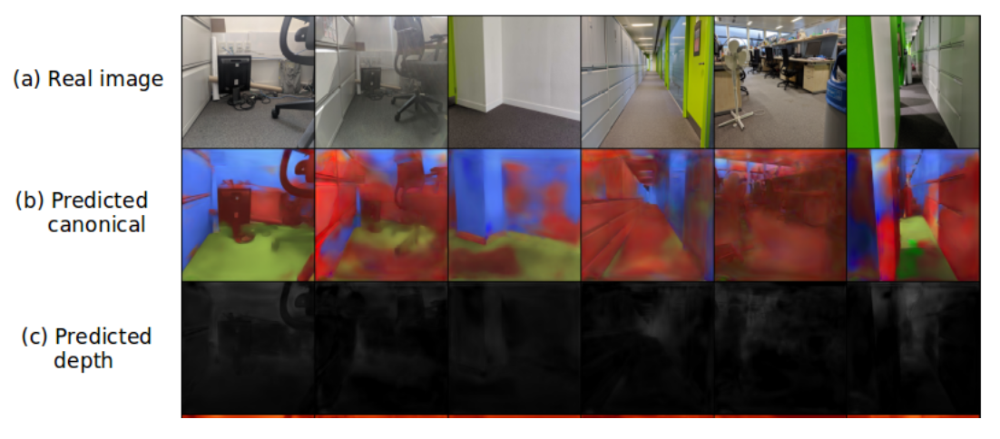

# Sim2Real for joint robotic locomotion and manipulation with RCAN

This repo complements [this](https://github.com/gn3112/robotics_drl/) project of robotics learning by providing Sim2Real transfer (from simulation to real-world) of the policy learned in simulation. The method used for Sim2Real borrows the idea of [RCAN](https://arxiv.org/abs/1812.07252) and extends it to locomotion and simultaneous manipulation and locomotion in arbitrary scenes.

## Dataset generation

## Validation results (in simulation)

## Real-world results

